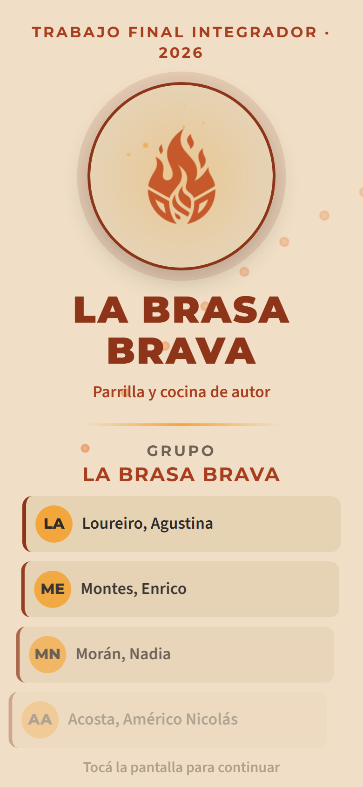
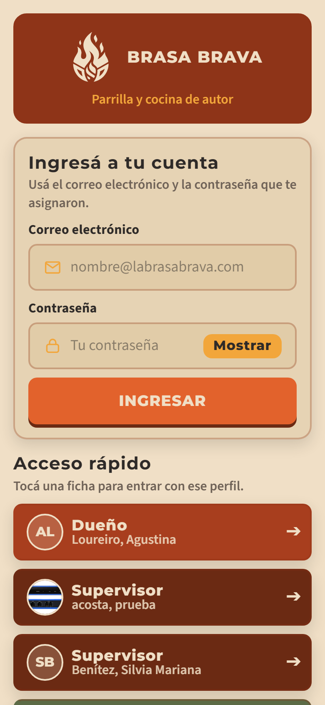
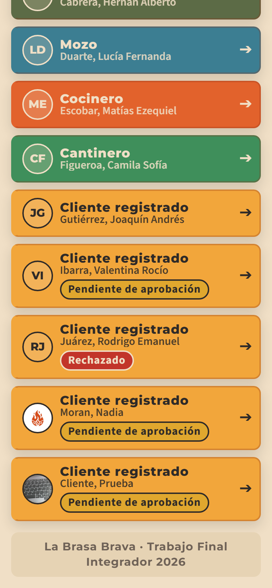
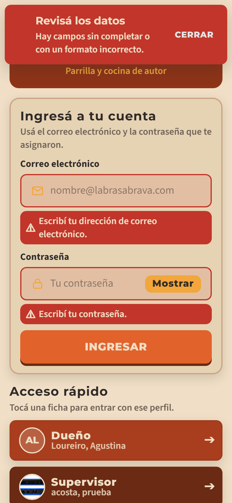
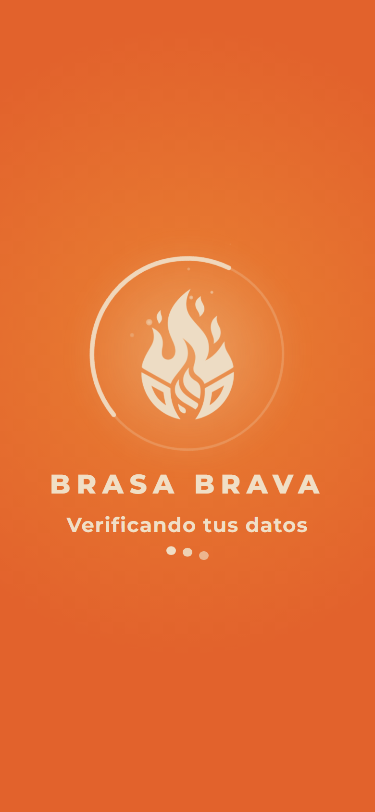
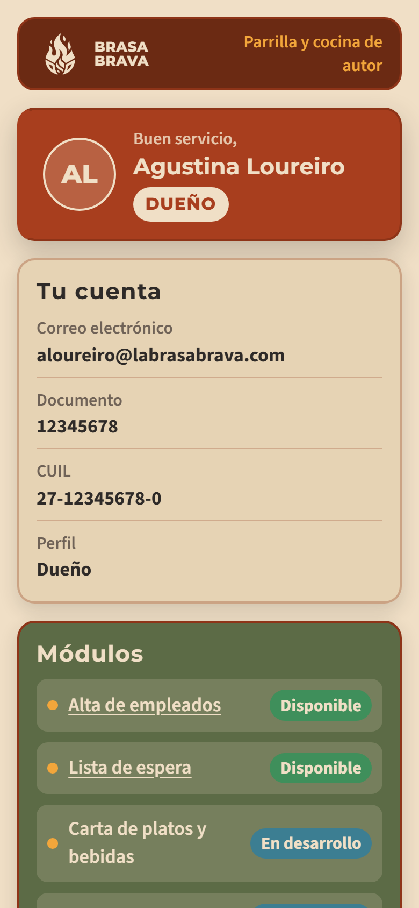

# La Brasa Brava — Trabajo Final Integrador 2026

Aplicación móvil de gestión integral para un restaurante: comanda para los empleados y
experiencia completa para el cliente.

> **Grupo:** _(completar)_ · **Materia:** Trabajo Final Integrador · **Año:** 2026
> **Universidad Tecnológica Nacional — Facultad Regional Avellaneda**

---

## Índice

1. [Integrantes y reparto de tareas](#1-integrantes-y-reparto-de-tareas)
2. [Índice de imágenes del proyecto](#2-índice-de-imágenes-del-proyecto)
3. [Códigos QR del sistema](#3-códigos-qr-del-sistema)
4. [Cómo levantar el proyecto](#4-cómo-levantar-el-proyecto)
5. [Usuarios de prueba](#5-usuarios-de-prueba)
6. [Tecnologías](#6-tecnologías)
7. [Estructura de carpetas](#7-estructura-de-carpetas)

---

## 1. Integrantes y reparto de tareas

> **Responsabilidad del líder del grupo.** Esta tabla debe estar actualizada al momento de
> cada entrega, preliminar o final. Si alguien no llega con su módulo, se cambia el plazo o
> se reasigna, y **queda informado acá**.

| Apellidos y nombres | Módulos (objetivos) a desarrollar | Inicio | Finalización | Branch |
|---|---|---|---|---|
| Montes, Enrico | Base del proyecto, identidad visual, animación de carga, pantallas de presentación, ingreso y cierre de sesión | 28-08-2026 | _(en curso)_ | `montes-branch` |
| Acosta, Américo Nicolás | Altas y validaciones: empleados (punto 1), platos (2), bebidas (3), mesas (4) | 03-09-2026 | _(en curso)_ | `acosta` |
| Morán, Nadia | Clientes: registro (5), aprobación (6), rechazo (7), aceptación (8), correos automáticos | 03-09-2026 | _(en curso)_ | `Moran` |
| Loureiro, Agustina | Salón: lista de espera (9), asignación de mesa (10), menú y consulta al mozo (11) | 03-09-2026 | _(en curso)_ | `rama-loureiro` |

### Propuesta de reparto para todo el cuatrimestre

El detalle completo, con el cronograma semana por semana y las reglas para no pisarse entre
ramas, está en **[REPARTO-DE-TAREAS.md](REPARTO-DE-TAREAS.md)**.

| Integrante | Primera fecha (17-10) | Segunda fecha (07-11) | Tercera fecha (28-11) |
|---|---|---|---|
| **1 — Núcleo y acceso** | Diseño, presentaciones, ingreso, cierre de sesión · Puntos 9, 10, 15, 21, 22 y los tres juegos | Punto 23 (redes sociales) | Puntos 24, 25, 26 (reservas) |
| **2 — Altas, carta y QR** | Puntos 1, 2, 3, 4 · Todos los códigos QR | Punto 22 (factura en PDF) | Punto 31 (acelerómetro y giroscopio) |
| **3 — Clientes y avisos** | Puntos 5, 6, 7, 8, 20 · Correos automáticos y notificaciones push | Envío de la factura por correo | Puntos 27, 28 (delivery) |
| **4 — Pedidos y comanda** | Puntos 11, 12, 13, 14, 16, 17, 18, 19 | — | Puntos 29, 30 (repartidor) |

**Transversales (los cuatro):** que ninguna pantalla tenga espacios neutros, que todo error
vibre, que toda espera muestre el spinner con el logo y que todos los campos estén validados.

---

## 2. Índice de imágenes del proyecto

> La cátedra exige que **TODAS Y CADA UNA** de las imágenes del proyecto estén enlazadas acá:
> íconos, pantallas de presentación, formularios, listados, etc.

### Identidad

| Imagen | Descripción |
|---|---|
|  | Isotipo a color, la variación principal del manual |
|  | Isotipo monocromo crema, para apoyar sobre fondos de color |
|  | Isotipo monocromo carbón, para impresión y códigos QR |
| _(pendiente)_ | Ícono de la aplicación (1024 × 1024) |
| _(pendiente)_ | Ícono enmascarable para Android |
| _(pendiente)_ | Pantalla de presentación estática de Capacitor |

### Pantallas

Las capturas se generan solas con `node revision-visual.mjs docs/pantallas`
(ver la sección 4), así que se mantienen al día sin sacarlas a mano.

| Imagen | Descripción |
|---|---|
|  | Presentación animada: animación de carga del logo, nombre del grupo e integrantes |
|  | Ingreso, con el formulario y el comienzo de los accesos rápidos |
|  | Accesos rápidos completos: un color por perfil y el estado de aprobación de cada cliente |
|  | Ingreso con los errores de validación de todos los campos |
|  | Indicador de espera: la animación de carga del logo sobre naranja brasa |
|  | Pantalla principal, con la ficha del perfil y el cierre de sesión |

---

## 3. Códigos QR del sistema

> Excluyente: **todos** los códigos QR deben estar disponibles acá y en pantalla.

| Código | Cantidad | Estado |
|---|---|---|
| Ingreso al local | 1 | _(pendiente)_ |
| Mesa (uno por mesa, generado automáticamente) | 5 o más | _(pendiente)_ |
| Propina — Excelente (20 %) | 1 | _(pendiente)_ |
| Propina — Muy bueno (15 %) | 1 | _(pendiente)_ |
| Propina — Bueno (10 %) | 1 | _(pendiente)_ |
| Propina — Regular (5 %) | 1 | _(pendiente)_ |
| Propina — Malo (0 %) | 1 | _(pendiente)_ |

---

## 4. Cómo levantar el proyecto

### Requisitos
- Node.js 20 o superior
- Android Studio con un dispositivo o emulador configurado
- Una cuenta en [Supabase](https://supabase.com)

### Pasos

```bash
# 1. Instalar las dependencias (siempre dentro de LaBrasaBrava)
cd LaBrasaBrava
npm install

# 2. Cargar los usuarios de prueba en la base del grupo
#    No hace falta ninguna clave secreta: usa la misma clave publicable
#    que la aplicación. Es idempotente, se puede correr las veces que sea.
node supabase/usuarios-de-prueba.mjs

# 3. Levantar la aplicación en el navegador
ionic serve

# 4. Compilar y abrir el proyecto de Android
ionic build
npx cap add android
npx cap sync
npx cap open android
```

> La conexión con Supabase ya está configurada, hoy en dos archivos:
> `LaBrasaBrava/src/environments/environment.ts` y
> `LaBrasaBrava/src/app/nucleo/configuracion.ts`. La clave que viaja ahí es la **publicable**,
> que es pública por diseño; la secreta nunca se sube al repositorio.

### Revisar las pantallas y actualizar las capturas

```bash
npm run build
npx http-server www -p 4300     # en otra terminal
node revision-visual.mjs docs/pantallas
```

Abre la aplicación en un teléfono simulado de 390 × 844, avisa si algo se sale del ancho de
la pantalla y deja actualizadas las capturas del índice de imágenes.

---

## 5. Usuarios de prueba

Todos usan la contraseña **`123456`**. Se cargan con
`node supabase/usuarios-de-prueba.mjs` y aparecen solos en la pantalla de ingreso como
accesos rápidos: las fichas se leen de la base, no son botones fijos.

Son los siete registros mínimos que exige el enunciado, más dos clientes extra para poder
probar la aprobación y el rechazo (puntos 6, 7 y 8).

| Perfil | Correo electrónico | Estado |
|---|---|---|
| Dueño | `aloureiro@labrasabrava.com` | — |
| Supervisor | `supervisora@labrasabrava.com` | — |
| Metre | `metre@labrasabrava.com` | — |
| Mozo | `mozo@labrasabrava.com` | — |
| Cocinero | `cocinero@labrasabrava.com` | — |
| Cantinero | `cantinero@labrasabrava.com` | — |
| Cliente registrado | `cliente@labrasabrava.com` | Aprobado, puede ingresar |
| Cliente registrado | `valentina.ibarra@ejemplo.com.ar` | Pendiente de aprobación, no puede ingresar |
| Cliente registrado | `rodrigo.juarez@ejemplo.com.ar` | Rechazado, no puede ingresar |

Las fotos quedan vacías a propósito: se cargan desde la cámara cuando se usan las pantallas
de alta de empleado (punto 1) y de cliente registrado (punto 5).

---

## 6. Tecnologías

| Área | Herramienta |
|---|---|
| Framework | Ionic 9 + Angular 22 (componentes standalone) |
| Empaquetado nativo | Capacitor 8 |
| Base de datos y autenticación | Supabase (PostgreSQL, Auth, Storage, Realtime) |
| Vibración | `@capacitor/haptics` |
| Sonidos | Web Audio API, generados por código |

---

## 7. Estructura de carpetas

> **Todo el proyecto vive dentro de `LaBrasaBrava/`.** No se crean carpetas de aplicación
> paralelas: es una sola aplicación de Ionic para los cuatro integrantes.

```
LaBrasaBrava/
  src/app/
    nucleo/
      marca.ts              Datos del grupo y del restaurante (ÚNICO archivo a editar)
      diseno.ts             Paleta y tipografías del manual, para usar desde TypeScript
      configuracion.ts      Conexión con Supabase
      modelos/              Tipos de datos (usuario, perfiles, estados de aprobación)
      servicios/            Sesión, mensajes, espera, sonidos y cliente de Supabase
      guardas/              Control de acceso por sesión y por perfil
    componentes/
      logo-marca/           Logo de la marca en sus tres variantes de color
      logo-cargando/        Animación de carga del logo (la del manual de marca)
      spinner-logo/         Indicador de espera a pantalla completa, con esa animación
    pages/
      presentacion/         Pantalla de presentación animada
      ingreso/              Formulario de ingreso y accesos rápidos
      principal/            Pantalla posterior al ingreso, con cierre de sesión
      empleado/             Alta de empleados
      plato/                Alta de platos
      lista-espera/         Lista de espera del salón
      registro-cliente/     Registro de clientes
      aprobacion-clientes/  Aprobación y rechazo de clientes
      encuesta/             Encuesta de satisfacción
    services/               Cámara, almacenamiento y un segundo cliente de Supabase
    home/                   Pantalla de inicio anterior, todavía en uso
  src/environments/         Conexión con Supabase (clave publicable)
  src/theme/variables.scss  Paleta y tipografías del manual, en CSS
  supabase/
    esquema.sql             Esquema OBJETIVO, para cuando se migre a Supabase Auth
    usuarios-de-prueba.mjs  Alta de los usuarios de prueba en la base actual
  docs/                     Auditoría del enunciado, manual de marca, capturas y guías
  revision-visual.mjs       Capturas de las pantallas y control de textos cortados
```

> **Duplicaciones pendientes de resolver entre todos.** Hoy conviven dos clientes de Supabase
> (`nucleo/servicios/supabase.service.ts` y `services/supabase.ts`), dos servicios de sesión
> (`nucleo/servicios/sesion.service.ts` y `services/sesion.ts`), dos pantallas de ingreso
> (`pages/ingreso/` y `pages/login/`) y dos pantallas de inicio (`pages/principal/` y `home/`).
> Todas funcionan, pero conviene quedarse con una de cada una antes de la primera entrega.

### Documentación

| Documento | Qué contiene |
|---|---|
| [Auditoría del enunciado](LaBrasaBrava/docs/AUDITORIA-DEL-ENUNCIADO.md) | Los 31 puntos funcionales del PDF, requerimientos excluyentes, perfiles y modelo de datos |
| [Cómo probar la aplicación](LaBrasaBrava/docs/COMO-PROBAR-LA-APP.md) | Las tres formas de verla andando y hasta dónde llega cada una |
| [Reparto de tareas](LaBrasaBrava/docs/REPARTO-DE-TAREAS.md) | Cronograma semana por semana y reglas para no pisarse entre ramas |
| [Flujo de trabajo](LaBrasaBrava/docs/FLUJO-DE-TRABAJO.md) | Cómo se rama, se commitea y se hace cada _pull request_ |
| [Manual de marca](LaBrasaBrava/docs/marca/MANUAL-DE-MARCA.md) | Logo, paleta, tipografías y animación de carga |

### Dos reglas de código que no se negocian

**Todo error pasa por `MensajesService`.** Nunca se usa `alert()`, y el servicio garantiza
que cada error vibre:

```ts
await this.mensajes.error('No pudimos verificarte', 'El correo o la contraseña son incorrectos.');
```

**Toda espera pasa por `CargandoService.durante()`.** Así ninguna queda sin el spinner con
el logo, incluso si la operación falla:

```ts
const resultado = await this.cargando.durante('Verificando tus datos', () =>
  this.sesion.ingresar(correo, clave),
);
```
