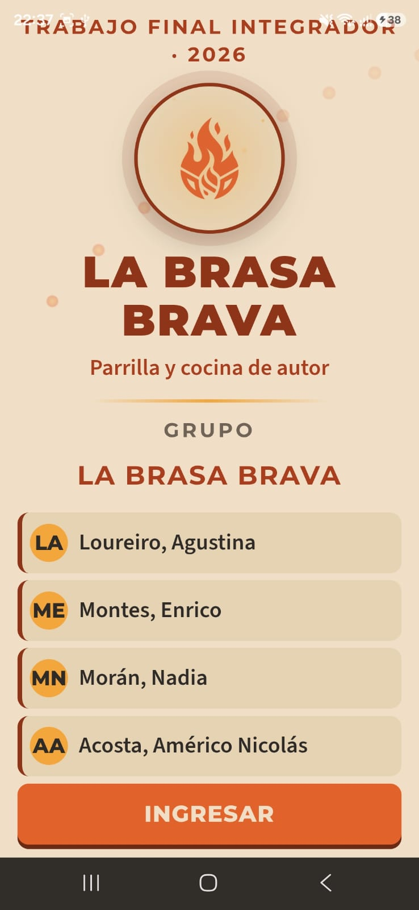
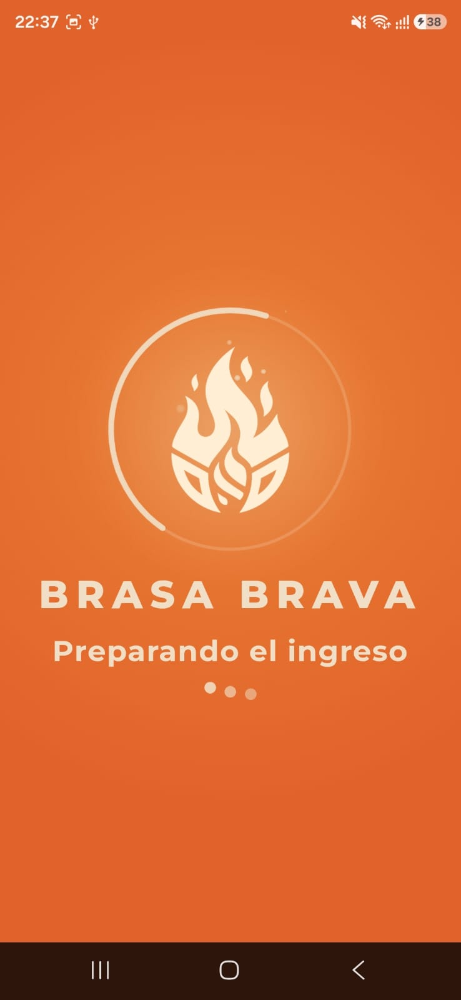
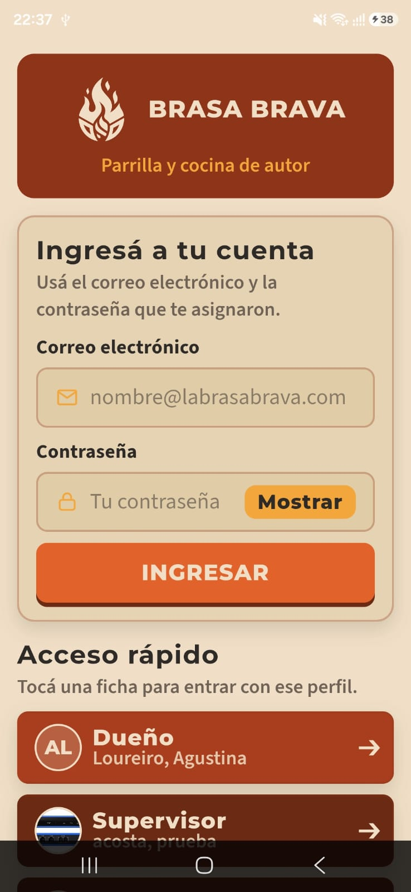
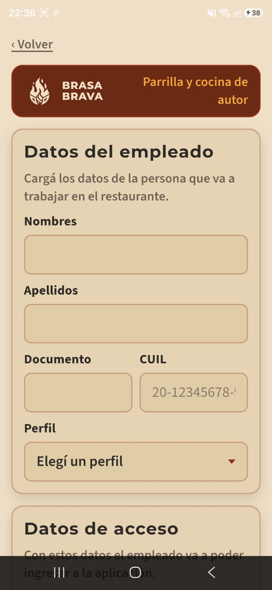
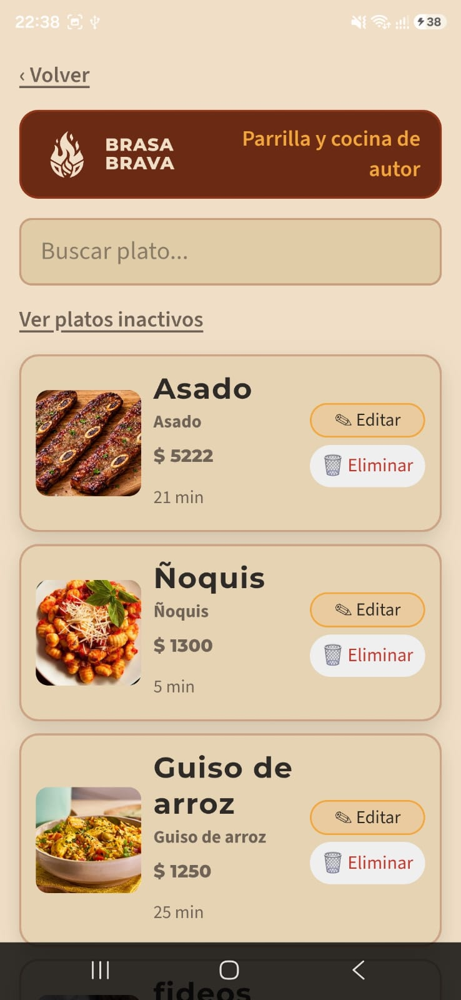
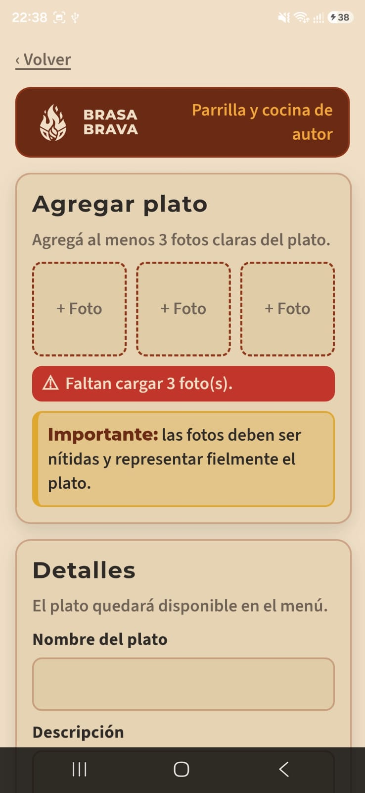
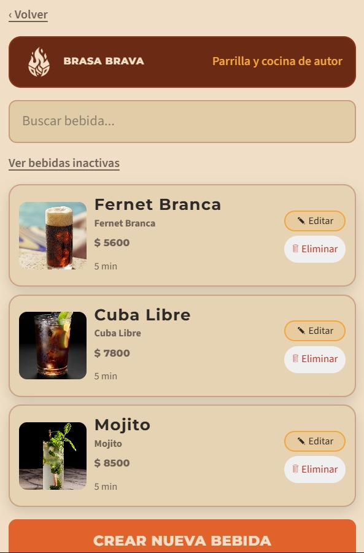
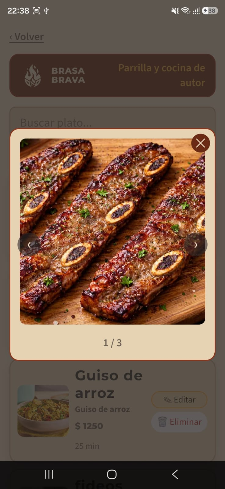

# La Brasa Brava — Gestión de Restaurante

Trabajo Final Integrador — Ionic + Angular + Capacitor + Supabase.

## Integrantes y responsabilidades

| Apellido y Nombre | Módulos desarrollados | Fecha de inicio | Fecha de fin | Branch |
|---|---|---|---|---|
| Acosta, Americo | Altas, carta y QR - Puntos 1, 2, 3, 4 (empleado, plato, bebida, mesa) + todos los códigos QR del sistema. | DD/MM/2026 | DD/MM/2026 | `acosta` |
| Loureiro, Agustina | Pedidos y comanda - Puntos 11, 12, 13, 14, 16, 17, 18, 19: menú, chat, armado del pedido, cocina, bar, entrega. | DD/MM/2026 | DD/MM/2026 | `rama-loureiro` |
| Montes, Enrico | Núcleo y acceso - Diseño, presentaciones, ingreso, cierre de sesión, control por perfil. Después: puntos 9, 10 (lista de espera y mesa), los tres juegos, y 21, 22 (cuenta, propina, pago). | DD/MM/2026 | DD/MM/2026 | `montes-branch` |
| Moran, Nadia | Pedidos y comanda - Puntos 11, 12, 13, 14, 16, 17, 18, 19: menú, chat, armado del pedido, cocina, bar, entrega. | DD/MM/2026 | DD/MM/2026 | `moran` |

> Si algún integrante no llega a terminar su módulo en el plazo previsto, actualizar esta tabla con la nueva fecha o el nuevo responsable, según corresponda.

## Desglose de tareas por integrante

Cuatro roles, mapeados contra los puntos funcionales del enunciado. Cada rol lista sus tareas en el orden en que conviene encararlas (no el orden numérico de la consigna), porque varias piezas de un rol son prerrequisito de otro.

### Dependencias entre roles

**Orden sugerido de arranque:** Montes y Acosta empiezan primero (nadie más puede avanzar sin sesión/perfiles ni sin el servicio de QR). Moran arranca en paralelo porque correos/push los necesitan casi todos. Loureiro depende de Acosta (mesas + QR) y de Moran (push), así que su tramo más largo empieza un poco después, pero al ser el flujo más extenso, no puede ser el último en largar.

<strong>1 — Núcleo y acceso (Montes)</strong>

**Bloque A: Fundacional (bloquea a todo el equipo)**
- [ ] Diseño de marca aplicado: splash screens (estática + animada), paleta, tipografías cargadas globalmente.
- [ ] Pantalla de presentación / ingreso (selección de perfil, botones de ingreso rápido).
- [ ] Sesión: guardar perfil activo, cerrar sesión con verificación de borrado de credenciales.
- [ ] Control de navegación por perfil (qué módulos ve cada rol, guards de ruta).

**Bloque B: Lista de espera y mesa (puntos 9, 10)**
- [ ] Alta de cliente anónimo (nombre + foto, sin aprobación).
- [ ] Escaneo del QR de ingreso → alta en lista de espera. *Depende de: servicio de QR (Acosta).*
- [ ] Vista de lista de espera para el metre, con push al aparecer un nuevo cliente. *Depende de: servicio de notificaciones (Moran).*
- [ ] Asignación de mesa por parte del metre + vínculo cliente-mesa vía escaneo del QR de mesa. *Depende de: QR de mesa (Acosta).*
- [ ] Validar que un cliente no pueda vincularse a más de una mesa, y que una mesa asignada no se le pueda dar a otro cliente.

**Bloque C: Juegos (parte de punto 15, ligado a 20)**
- [ ] Pantalla selectora de juegos.
- [ ] 3 juegos simples, completamente funcionales, cada uno asociado a un descuento (10/15/20%).
- [ ] Lógica de "solo se aplica descuento si se gana en el primer intento", no acumulable.
- [ ] Persistir el resultado (ganó/perdió, descuento obtenido) asociado a la estadía del cliente.

**Bloque D: Cuenta, propina y pago (puntos 21, 22)**
- [ ] Habilitar "pedir cuenta" solo tras escanear el QR de propina. *Depende de: QR de propina (Acosta).*
- [ ] Pantalla de cuenta: ítems con precio unitario, descuento de juegos aplicado, propina, total grande y visible.
- [ ] Pago simulado + push de confirmación al mozo, dueño y supervisor. *Depende de: notificaciones (Moran).*
- [ ] Mozo confirma pago → liberar mesa (vuelve a "vacía", requiere nuevo escaneo de QR).
- [ ] (Segunda fecha) Factura en PDF + envío/descarga según tipo de cliente.

> **Por qué juegos y cuenta van con la misma persona:** el porcentaje de descuento que se calcula en el Bloque C es un input directo del Bloque D. Si dos personas distintas tocan esto, cualquier cambio en la lógica de un lado rompe silenciosamente al otro sin que se note hasta la demo.

<strong>2 — Altas, carta y QR (Acosta)</strong>

**Bloque A: Servicio de QR (bloquea a Montes y Loureiro — arrancar primero)**
- [ ] Servicio central de generación de QR (mesa, ingreso, propina).
- [ ] Servicio central de lectura de QR (y lectura de PDF417 para el DNI, que no es QR).
- [ ] Definir y documentar el formato de cada valor codificado (para que el resto del equipo sepa qué esperar al leer).
- [ ] Generar y dejar disponibles los 5 QR de propina y el QR de ingreso (fijos, únicos).

**Bloque B: Altas (puntos 1, 2, 3, 4)**
- [ ] Alta de empleado: datos + foto por cámara + lectura de QR/código de DNI para autocompletar.
- [ ] Alta de plato: datos + 3 fotos (cámara o galería) + validación de existencia en la carta.
- [ ] Alta de bebida: igual que plato.
- [ ] Alta de mesa: datos + foto + generación automática del QR de esa mesa al guardar.
- [ ] Validación completa de todos los campos de las 4 altas (formato, vacíos, tipos de dato).
- [ ] Gestión de mesas: listado con posibilidad de modificar disponibilidad manualmente.

> **Por qué el QR va primero acá:** tanto Montes (ingreso, mesa, propina) como Loureiro (vincular pedido a una mesa) necesitan el servicio de QR ya armado para poder avanzar. Si el Bloque A se atrasa, atrasa a dos personas más, no solo a Acosta.

<strong>3 — Clientes, correos y notificaciones (Moran)</strong>

**Bloque A: Servicios transversales (bloquea a casi todo el resto — arrancar en paralelo con Acosta)**
- [ ] Servicio de envío de correo automático (cuenta propia del proyecto, nunca personal) con plantilla de marca (logo, colores, tipografía propios).
- [ ] Servicio de notificaciones push (app abierta y cerrada).
- [ ] Documentar cómo el resto del equipo dispara un correo o un push desde su propio módulo, para no reinventar la conexión en cada pantalla.

**Bloque B: Registro y aprobación de clientes (puntos 5, 6, 7, 8)**
- [ ] Registro de cliente: datos + foto + lectura de QR de DNI. *Depende de: lectura de QR (Acosta).*
- [ ] Estado "pendiente de aprobación" al registrarse.
- [ ] Listado de clientes pendientes para dueño/supervisor, con foto y datos visibles.
- [ ] Aceptar/rechazar cliente + mail automático correspondiente (plantillas distintas para aceptación y rechazo).
- [ ] Verificar que el cliente rechazado no pueda ingresar, y que el aceptado sí.

**Bloque C: Encuesta y gráficos (punto 20)**
- [ ] Formulario de encuesta con variedad de controles (no repetir el mismo tipo de control en todas las preguntas).
- [ ] Restricción de una encuesta por estadía.
- [ ] Visualización de resultados en gráficos (torta, barra, lineal), un gráfico por pantalla.

> **Por qué esto tiene que estar temprano:** correos y push no son solo "el módulo de Moran" — son infraestructura que Acosta (aprobación de cliente), Montes (lista de espera, cuenta) y Loureiro (estados de pedido) van a llamar desde su propio código. Si el servicio no existe todavía, esas otras personas quedan bloqueadas o tienen que simular la llamada y volver después a conectarla de verdad.

<strong>4 — Pedidos y comanda (Loureiro)</strong>

**Bloque A: Menú y consulta al mozo (punto 11)**
- [ ] Al escanear QR de mesa, mostrar listado de productos (3 fotos, nombre, precio, descripción, tiempo). *Depende de: QR de mesa (Acosta) y catálogo de platos/bebidas (Acosta).*
- [ ] Botón de consulta rápida al mozo, habilitado solo con mesa asignada.
- [ ] Chat estilo WhatsApp entre mozos y clientes, con push a los mozos por cada consulta nueva. *Depende de: notificaciones (Moran).*

**Bloque B: Armado y confirmación del pedido (puntos 12, 13, 14)**
- [ ] Selección de productos y cantidades para todos los comensales de la mesa.
- [ ] Importe acumulado siempre visible + tiempo total estimado.
- [ ] Envío del pedido y espera de confirmación del mozo (push). *Depende de: notificaciones (Moran).*
- [ ] Mozo rechaza pedido (parcial o total) → cliente puede modificar y reenviar.
- [ ] Mozo confirma → el pedido se deriva a cocina y bar, no antes.

**Bloque C: Sectores (puntos 16, 17, 18)**
- [ ] Vista de pedidos pendientes para cocina: agrupados por mesa, con fecha/hora e ítems a elaborar.
- [ ] Misma vista para bar (mismo componente, filtrado por sector).
- [ ] Notificar al mozo cuando todas las partes del pedido (cocina + bar) estén listas, no antes.
- [ ] El cliente ve el cambio de estado de su pedido en cada paso.

**Bloque D: Entrega (punto 19)**
- [ ] Mozo entrega el pedido completo, cliente confirma recepción.
- [ ] Al confirmar, habilitar acceso a juegos, encuesta y "pedir cuenta" desde el lado del cliente (la lógica de esos tres módulos la implementan Montes y Moran, acá solo se habilita la navegación).

> **Por qué 16-17-18 no son tres tareas triples:** cocina y bar son la misma pantalla con un filtro de sector distinto — armar el componente una vez y parametrizarlo ahorra reescribir el mismo listado dos veces. Y 13-14 reutilizan casi toda la estructura de datos de 12 (mismo pedido, distintos estados), así que conviene diseñar el modelo de "pedido con estados" pensando en los tres puntos juntos desde el principio, no ir parcheando sobre la marcha.

### Checklist de integración (para revisar en las reuniones semanales)

- [ ] ¿El servicio de QR (Acosta) ya está disponible antes de que Montes/Loureiro lo necesiten?
- [ ] ¿El servicio de correo/push (Moran) ya está disponible antes de que Acosta/Montes/Loureiro lo necesiten?
- [ ] ¿El modelo de datos de "pedido" (Loureiro) está definido antes de que Montes empiece la pantalla de cuenta (que lee ese mismo pedido)?
- [ ] ¿Cada README de branch tiene actualizada la fecha real de avance, no la fecha planeada original?

## Historial de Pull Requests

| PR | Título | Autor | Fecha de merge | Enlace |
|---|---|---|---|---|
| #1 | Moran | nadiamoran | 2026-09-03 | [Ver PR](https://github.com/acostaamericonicolas/LaBrasaBrava-2026/pull/1) |
| #2 | Supabase conectada | AgustinaLoureiro | 2026-08-31 | [Ver PR](https://github.com/acostaamericonicolas/LaBrasaBrava-2026/pull/2) |
| #3 | Login y empleado | AgustinaLoureiro | 2026-09-03 | [Ver PR](https://github.com/acostaamericonicolas/LaBrasaBrava-2026/pull/3) |
| #4 | Animación de carga del logo, alta de los usuarios de prueba e ingreso de clientes | EnricoMontes | 2026-09-05 | [Ver PR](https://github.com/acostaamericonicolas/LaBrasaBrava-2026/pull/4) |
| #5 | Revert "Animación de carga del logo, alta de los usuarios de prueba e ingreso de clientes" | nadiamoran | 2026-09-05 | [Ver PR](https://github.com/acostaamericonicolas/LaBrasaBrava-2026/pull/5) |
| #6 | Acosta | acostaamericonicolas | 2026-09-05 | [Ver PR](https://github.com/acostaamericonicolas/LaBrasaBrava-2026/pull/6) |
| #7 | Moran | nadiamoran | 2026-09-05 | [Ver PR](https://github.com/acostaamericonicolas/LaBrasaBrava-2026/pull/7) |
| #8 | Arreglar la compilación y enchufar las pantallas que estaban sin ruta | EnricoMontes | 2026-09-05 | [Ver PR](https://github.com/acostaamericonicolas/LaBrasaBrava-2026/pull/8) |
| #9 | Botón «Ingresar» en la presentación y limpieza del repositorio | EnricoMontes | 2026-09-05 | [Ver PR](https://github.com/acostaamericonicolas/LaBrasaBrava-2026/pull/9) |
| #10 | Sacar de verdad la documentación y las capturas del repositorio | EnricoMontes | 2026-09-05 | [Ver PR](https://github.com/acostaamericonicolas/LaBrasaBrava-2026/pull/10) |
| #11 | Modifica la tabla de clientes de Supabase. Pasa a Supabase Auth. | nadiamoran | 2026-09-05 | [Ver PR](https://github.com/acostaamericonicolas/LaBrasaBrava-2026/pull/11) |
| #12 | Limpieza de archivos duplicados, importaciones corregidas | AgustinaLoureiro | 2026-09-05 | [Ver PR](https://github.com/acostaamericonicolas/LaBrasaBrava-2026/pull/12) |
| #13 | Cambia Supabase por Supabase.services | nadiamoran | 2026-09-05 | [Ver PR](https://github.com/acostaamericonicolas/LaBrasaBrava-2026/pull/13) |
| #14 | Módulos por perfil, estilo de las pantallas nuevas e ingreso de clientes | EnricoMontes | 2026-09-08 | [Ver PR](https://github.com/acostaamericonicolas/LaBrasaBrava-2026/pull/14) |
| #15 | Alta de mesa + alta de bebida | acostaamericonicolas | 2026-09-08 | [Ver PR](https://github.com/acostaamericonicolas/LaBrasaBrava-2026/pull/15) |
| #17 | Llamada a la función filtro | acostaamericonicolas | 2026-09-08 | [Ver PR](https://github.com/acostaamericonicolas/LaBrasaBrava-2026/pull/17) |
| #18 | Agrega página de aprobación de clientes, envío de mails de aprobación y de rechazo con Resend | nadiamoran | 2026-09-08 | [Ver PR](https://github.com/acostaamericonicolas/LaBrasaBrava-2026/pull/18) |

*(tabla generada con `gh pr list`, ver comando en la sección de mantenimiento más abajo)*

## Índice de imágenes

Todas las capturas de pantalla del proyecto viven en [`docs/screenshots/`](./docs/screenshots/).

| Pantalla | Imagen |
|---|---|
| Presentacion |  |
| Spiner APP |  |
| Login |  |
| Alta de empleado |  |
| Listado de platos |  |
| Formulario de plato |  |
| Listado de bebidas |  |
| Carrusel de fotos del plato |  |
| Listado de mesas |  |
| QR de mesa |  |

*(agregar una fila por cada pantalla nueva a medida que se completen los puntos funcionales — la consigna pide TODAS las imágenes asociadas al proyecto, incluyendo íconos y formularios)*

## Stack técnico

- **Frontend:** Ionic + Angular (standalone components) + Capacitor
- **Backend:** Supabase (Postgres, Auth, Storage, Realtime)
- **Repositorio:** GitHub

## Cómo correr el proyecto

\`\`\`bash
npm install
ionic serve                          # navegador
ionic capacitor run android -l --external   # dispositivo/emulador Android
\`\`\`

## Mantenimiento de este README

Para regenerar la tabla de Pull Requests:
\`\`\`powershell
gh pr list --state merged --json number,title,author,mergedAt,url --limit 200 | ConvertFrom-Json | ForEach-Object {
  "| #$($_.number) | $($_.title) | $($_.author.login) | $($_.mergedAt.Substring(0,10)) | [Ver PR]($($_.url)) |"
}
\`\`\`
